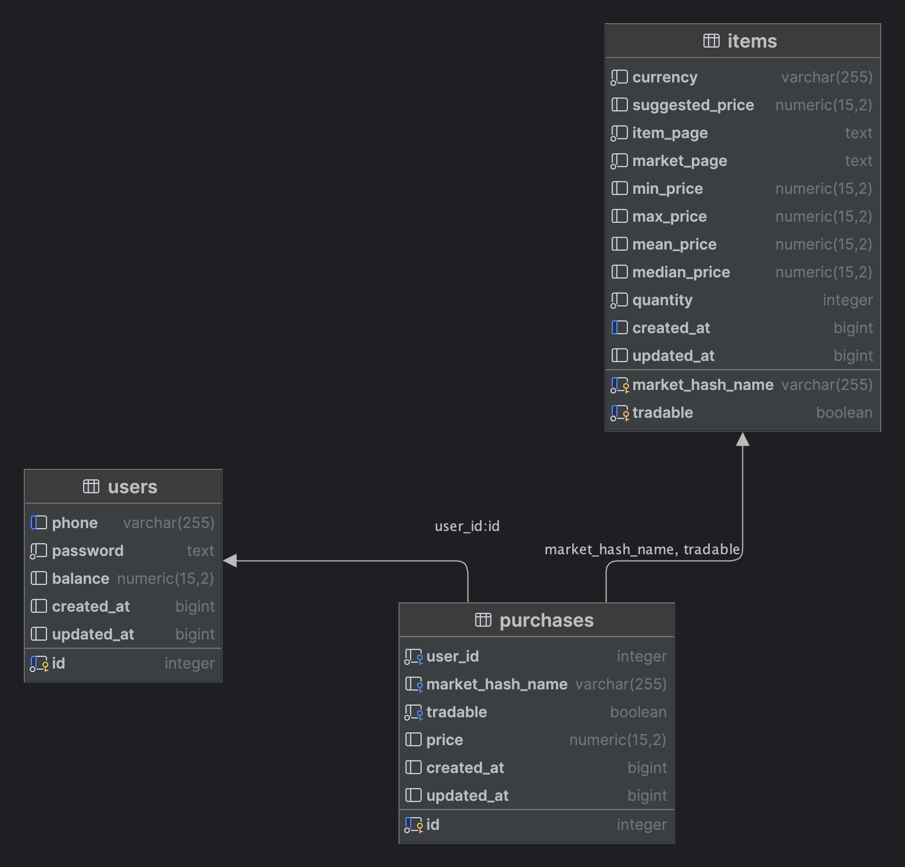

# CMarket

### Tech

NodeJS, Typescript (strict), NestJS, Postgres (postgres.js), Redis, Docker 

### Run
1. Rename .env.sample to .env
2. Fill .env file
3. Run `docker compose up -d --build`
4. Setup db schema via migrations files

### DB

Migrations - `./src/database/migrations`

Schema

